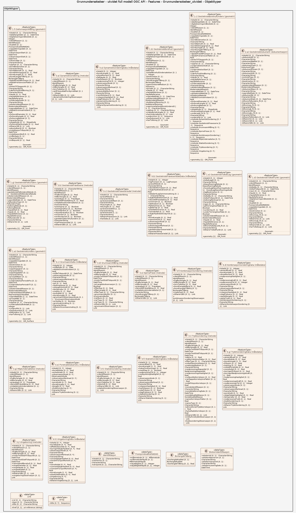

# Produktspesifikasjon: Grunnundersøkelser - utvidet full modell OGC API - Features

*Tjenesten ble opprettet i 2025 og følger standarden "OGC API - Features". NGU har utviklet Nasjonal database for grunnundersøkelser (NADAG) med tilhørende karttjenester og muligheter for innmelding og nedlasting av data fra geotekniske undersøkelser. Fra og med 2025 er det lovfestet plikt for innmelding av komplette geotekniske grunnundersøkelser til NADAG. Eldre data har stor nytteverdi, og ønskes også meldt inn. Prosjektet for utvikling av NADAG er et samarbeid mellom NGU og etatene Statens vegvesen, Bane NOR, og Norges vassdrags- og energidirektorat (NVE). NGU samarbeider også med ulike konsulenter i utviklingen av løsningene.

Punktene i NADAGs kartinnsyn representerer geotekniske borehull (GB), hvor metadata vises (f.eks. boretype, oppdragsfirma, oppdragsgiver, stedfestelse (posisjon), boret dybde, ev. dyp til berg). For noen punkter vil mer informasjon være tilgjengelig (f.eks. lenke til rapport og ev. rådata, boreprofil og måleresultater). NADAGs datamodell er basert på en datastruktur beskrevet i SOSI-standardene for Geovitenskapelige undersøkelser og Geotekniske undersøkelser. NADAG er innlemmet i listen over datasett til DOK. Visningstjenesten til NADAG har to innsynsløsninger, der «Mobilvennlig versjon» ligner de andre kartinnsynene til NGU, mens «NADAG fullversjon» har litt annet oppsett og andre verktøy.*

**Nøkkelord:** 

**Emnekategorier:** 

**Geografisk utstrekning**:

- **Vest**: 2.0
- **Øst**: 33.0
- **Sør**: 57.0
- **Nord**: 72.0

**Tidsmessig utstrekning**:

- **Tidsperiode**:
  - **Fra**: 2026-03-11
  - **Til**: 2026-03-11

## Om spesifikasjonen

> **Denne versjonen av produktspesifikasjonen:**  
> **Opprettet dato:** 2026-03-11 
> **Endret dato:** 2026-03-11 
> **Språk:**  
> **Kontaktinformasjon:** Norges geologiske undersøkelse, [wmsdrift@ngu.no](mailto:wmsdrift@ngu.no)

## Om produktet Grunnundersøkelser - utvidet full modell OGC API - Features

> **Romlig representasjonstype:**  
> **Unik identifikator:** e84be2c5-cb0a-43c5-b702-d3f7901cd14d 
> **Kontaktinformasjon:** Norges geologiske undersøkelse, [wmsdrift@ngu.no](mailto:wmsdrift@ngu.no)
>
> **Romlig oppløsning:**
>
>
>
> **Begrensninger:**
>
> **Juridiske begrensninger**:
>
> - **Tilgangsbegrensninger**: Åpne data
> - **Bruksbegrensninger**: Lisens
> - **Lisens**: Norsk lisens for offentlige data (NLOD)
> - **Lisenslenke**: <http://data.norge.no/nlod/no/1.0>

### Bruksområde

Kan for eksempel benyttes til kart og presentasjoner og til ulike analyser og geografi. 
Fra og med 2025 er det lovfestet plikt for innmelding av geotekniske grunnundersøkelser til NADAG. For at gjenbruk av data fra grunnundersøkelser skal bli mest mulig effektiv og til nytte for samfunnet, bør også data fra eldre prosjekter leveres til NADAG. Disse må gjerne også leveres mest mulig komplett, siden de da blir enklere å gjenbruke i nye prosjekter for konsulenter og andre aktører. En rask og oppdatert oversikt over utførte geotekniske undersøkelser i et gitt område vil være nyttig som verktøy i arealplanlegging, utbygging og ressursleting. Rask tilgang til data om undergrunnen vil også være avgjørende for beredskap og krisehåndtering i forbindelse med naturfare. I tillegg vil informasjon om hvor undersøkelser er utført kunne redusere behovet for nye undersøkelser, og hindre dobbeltarbeid. Ved å samle grunnundersøkelsene i Norge vil dette være et langt steg framover mot å bygge opp en forståelse av grunnforholdene i tre dimensjoner. Løsningen sørger for en lik strukturering (harmonisering) av data.

## Omfang

### Hele datasettet

**Nivå**: dataset

**Nivåbeskrivelse**: Gjelder hele datasettet. Hvis omfang ikke er oppgitt under en overskrift, gjelder teksten for hele datasettet og alle leveranser

### Grunnundersokelser_utvidet

**Nivå**: dataset

**Nivåbeskrivelse**: OGC API-Features fra Norges geologiske undersøkelse

## Datainnhold og struktur

### Datamodell - Grunnundersokelser_utvidet

➡️ [Se full datamodell for omfang "Grunnundersokelser_utvidet" (diagram per pakke og objektkatalog)](grunnundersokelser-utvidet/objektkatalog.html)

## Datakvalitet

**Nivå**: service

## Vedlikehold

**Vedlikeholdsfrekvens**: Etter behov

## Leveranse

| Tjeneste | Endepunkt | Type | Format | Leveranseenheter |
| --- | --- | --- | --- | --- |
| OGC API-Features | [Lenke](https://geo.ngu.no/api/features/grunnundersokelser_utvidet) | OGC:API-Features | JSON, GeoJSON, HTML | landsfiler |

## Metadata

**Metadatastandard**: ISO19115

**Metadatastandardversjon**: 2003

**Metadatadato**: 2026-04-30

**språk**: nor

**Kontakt**:

- **Organisasjon**: Norges geologiske undersøkelse
- **Logo**: <https://register.geonorge.no/data/organizations/970188290_NGU_hovedlogo_svart.svg> thumbnail.png
- **Epost**: metadataansvarlig@ngu.no
- **rolle**: pointOfContact

**Metadataidentifikator**:

- **Utsteder**: Geonorge
- **kode**: e84be2c5-cb0a-43c5-b702-d3f7901cd14d
- **koderom**: <https://kartkatalog.geonorge.no/metadata/>
- **Metadatalenke**: <https://kartkatalog.geonorge.no/metadata/e84be2c5-cb0a-43c5-b702-d3f7901cd14d>

